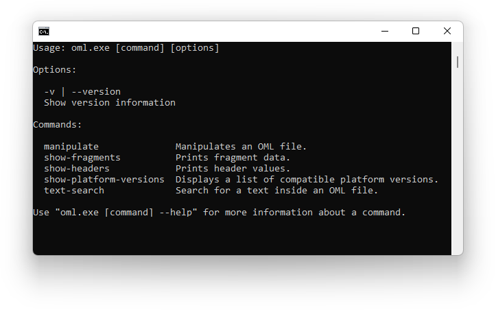

# OML Utilities

A small console application containing utility functions for OutSystems OML files.



## Usage Examples

### Export OML as XML

```
oml manipulate "<InputFilePath>" "<OutputFilePath>" --format xml
```

This generates a XML file in the `OutputFilePath` destination containing all fragments. The `--format` option is optional if the destination file path ends with the ".xml" extension, e.g.:

```
oml manipulate "C:\MyModule.oml" "C:\MyModule.xml"
```

### List supported platform versions

```
oml show-platform-versions
```

Lists the supported platform versions of the utility in ascending order. More versions can be added in the future.

By default, displayed platform versions are shown as labels (e.g. "O10"). If desired, versions can be retrieved fully-formatted (e.g. "9.1.603.0" instead of "O9.1") by adding the `--full-version` flag:

```
oml show-platform-versions --full-version
```

Optionally, the `--latest` flag can be added as well for outputting only the highest supported platform version, e.g.:

```
oml show-platform-versions --full-version --latest
```

### Show header values

```
oml show-headers "<InputFilePath>"
```

Displays a list of headers of the given OML file. Headers are shown in the following format: `[Writable|ReadOnly],[DataType],[HeaderName]:[HeaderValue]`.

Header values (after the colon ':') might be URL-encoded. You should run them through a URL-decode function.

If desired, only a single header value can be shown by specifying the header name as the last parameter, e.g.:

```
oml show-headers "C:\MyModule.oml" ESpaceType
```

### Change header values

```
oml manipulate "<InputFilePath>" "<OutputFilePath>" -H "<HeaderName>:<HeaderValue>"
```

Changes the value of one or more headers. Some headers are read-only and cannot be modified.

Multiple headers can be modified at once by repeating the `-H` option, e.g.:

```
oml manipulate "C:\MyModule.oml" "C:\MyModule_Edited.oml" -H "Name:MyModule" -H "Description:This is my module."
```

### Replace XML fragment

```
oml manipulate "<InputFilePath>" "<OutputFilePath>" -F "<FragmentXmlContent>"
```

Replaces the XML contents of a fragment of the OML file. This enables advanced use cases by allowing to programatically modify the code an OML file and automating tasks that would be otherwise monotonous and time consuming in Service Studio.

Notice that the fragment is fully replaced by the new XML.

Multiple fragments can be modified at once by repeating the `-F` option, e.g.:

```
oml manipulate "C:\MyModule.oml" "C:\MyModule_Edited.oml" -F "<eSpaceFragment FragmentName=\"MyFragment1\">" -F "<eSpaceFragment FragmentName=\"MyFragment2\">"
```

### OML Text Search

```
oml text-search "<InputDirectory>" "<Keyword>"
```

Performs a text search inside a OML (eSpace) over all OML files in a specified directory. Ideal for find uses of Built-function or something else.

The search result will be displayed in console terminal. 

Notice that the search is a case sensitive.

```
oml text-search "C:\omldir" "TextToSearch"
```
